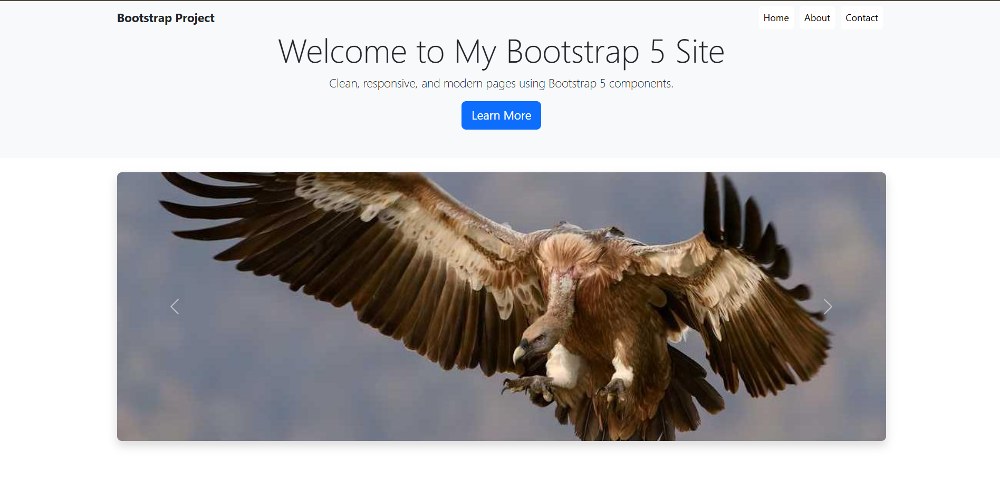

# Bootstrap 5 Project 🚀

This project is a simple, modern, and responsive website built using **Bootstrap 5**.  
The goal of the project is to practice creating clean layouts and combining Bootstrap components into attractive, functional pages.  

---

## 🌐 Live Demo
👉 [View Live Project](https://project7968.netlify.app/)

---

## 📸 Preview
Here’s a quick look at the live site:  

*(Replace `screenshot.png` with the actual path of your screenshot in the repo,  
or use a direct image link if hosted online, e.g., `https://i.imgur.com/abcd123.png`)*  

---

## 📌 Features
- **Responsive Navbar** → Transparent with clean button-style links.  
- **Home Page** → Hero section, carousel, and project feature cards.  
- **About Page** → Details about the project with interactive modal and feature cards.  
- **Contact Page** → Functional contact form with Bootstrap form controls.  
- **Sticky Footer** → Always stays at the bottom.  
- **Hover Effects** → Cards scale and shadow on hover for better UI/UX.  

---

## 🛠️ Technologies Used
- **HTML5**  
- **CSS3**  
- **Bootstrap 5** (via CDN)  
- **Git & GitHub** for version control and hosting  

---

## 📂 Project Structure
